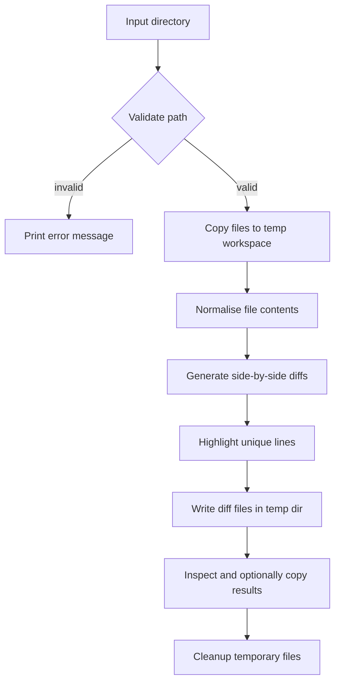

# diff-multi

diff-multi provides a helper script, `dirDiff.sh`, that extracts the unique lines from
every file in a directory. The script copies each file into a temporary working area,
normalises their contents, and generates a side-by-side style report that highlights the
lines that only appear in a single file.

## Usage

```
./dirDiff.sh <directory>
```

The command expects a directory that contains the files you want to compare. If the
provided path does not exist, is not a directory, or does not contain any files,
the script prints a helpful error message and exits.

A successful run leaves the generated diffs inside a temporary directory that is
cleaned up automatically when the script exits. Each diff file contains three sections:

* A header showing the original filename.
* The normalised file contents with infrequent tokens replaced by placeholders.
* An `=== missing ===` block that shows the common lines shared across the files.

You can inspect the diff files while the script is running by browsing the temporary
`diff` directory printed in the script's output. Copy any files you want to keep before
it finishes so they are not removed by the cleanup step.

## Diagram


